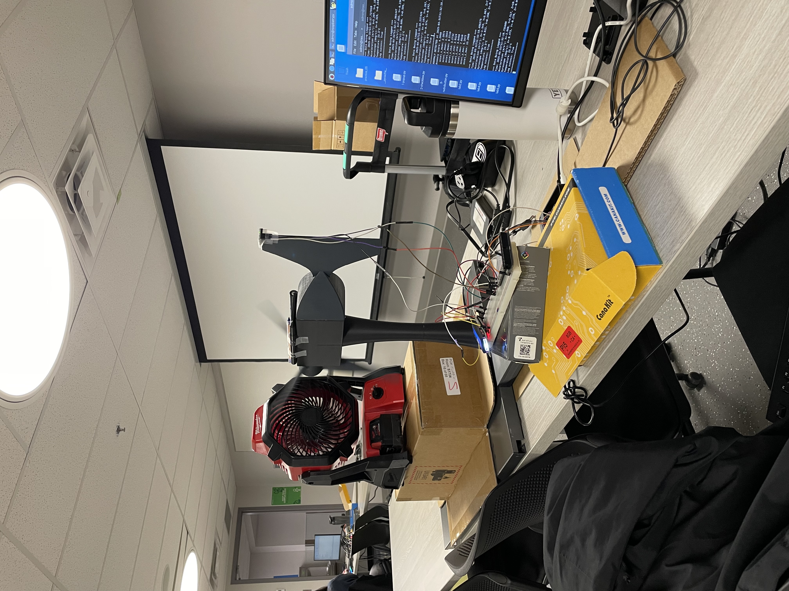

# Wind Turbine Vibration Detector
Team members: Jordan Craig (Hardware), Chun Ho Law (Hardware), Narges Ehdaei (Data Science, Hardware-Software Integration), Darvin (Software)


A real-time vibration monitoring and anomaly detection system for wind turbines using MPU6050 sensors and machine learning.

## Overview

This project implements a vibration monitoring system that uses an MPU6050 sensor to collect accelerometer and gyroscope data from a wind turbine. The system processes this data in real-time and uses a One-Class Support Vector Machine (OCSVM) to detect anomalous vibrations that could indicate potential issues with the turbine.

## Features

- Real-time vibration monitoring using MPU6050 sensor
- Feature extraction from accelerometer and gyroscope data
- Anomaly detection using One-Class SVM
- LCD display for real-time monitoring
- SMS alerts for detected anomalies

## Hardware Requirements

- Raspberry Pi
- MPU6050 sensor
- I2C LCD display (16x2)

## Installation

1. Clone the repository:
```bash
git clone git@github.com:darviny/wind_turbine_vibration_detector.git
cd wind_turbine_vibration_detector
```

2. Install dependencies:
```bash
pip install -r requirements.txt
```

3. Set up environment variables for SMS alerts:
```bash
export TWILIO_ACCOUNT_SID='your_account_sid'
export TWILIO_AUTH_TOKEN='your_auth_token'
export TWILIO_FROM_PHONE='your_twilio_phone_number'
```

## Project Structure

- `main.py` - Main application entry point
- `sensor.py` - Sensor data collection and processing
- `anomaly_detector.py` - OCSVM-based anomaly detection
- `train_ocsvm.py` - Model training script
- `evaluate_ocsvm.py` - Model evaluation script
- `extract_features.py` - Feature extraction from sensor data
- `lcd_alert.py` - LCD display interface
- `sms_alert.py` - SMS alert functionality

## Usage

### Training the Model

1. Collect normal operation data:
```bash
python main.py false
```

2. Extract features from the collected data:
```bash
python extract_features.py data/sensor_data_normal.csv data/features_normal.csv 5 6.6
```

3. Train the OCSVM model:
```bash
python train_ocsvm.py data/features_normal.csv models/model_svm.pkl models/scaler.pkl
```

### Running the Monitoring System

Start the monitoring system with alerts enabled:
```bash
python main.py true
```

Optional parameters:
- `sensitivity`: Float between 0.0 and 1.0 (default: 0.5)
- `threshold`: Anomaly threshold (default: -0.5)

### Evaluating the Model

Evaluate the model's performance:
```bash
python evaluate_ocsvm.py models/model_svm.pkl models/scaler.pkl data/features_normal.csv data/features_anomaly1.csv data/features_anomaly2.csv
```

## Data Collection

The system collects the following sensor data:
- Accelerometer (X, Y, Z axes)
- Gyroscope (X, Y, Z axes)
- Temperature

Data is collected at 5Hz and processed in 3.5-second windows (matching the turbine's periodicity).

## Alert System

The system provides two types of alerts:
1. LCD Display: Shows real-time sensor readings and anomaly alerts
2. SMS Alerts: Sends notifications when anomalies are detected (with a 10-second cooldown period)
